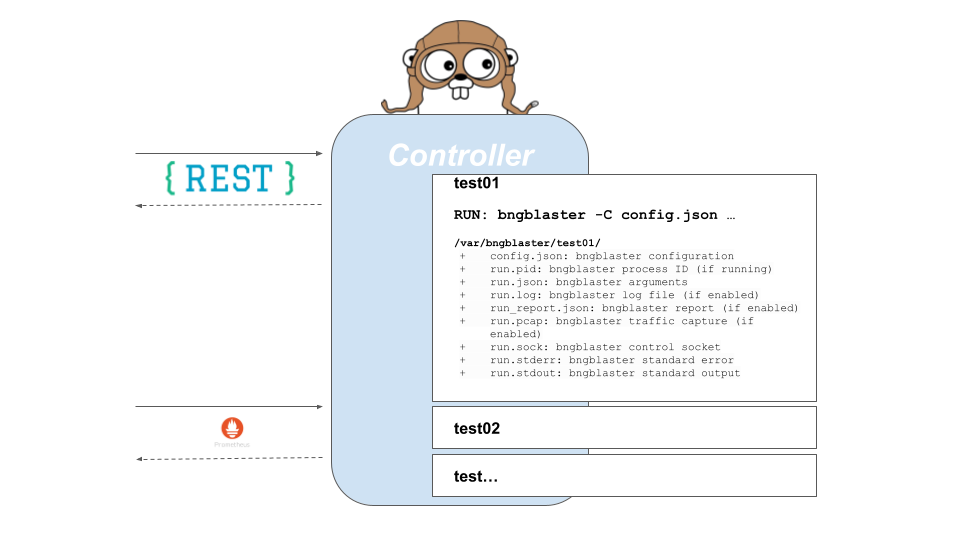

# BNG Blaster Control Daemon

[](https://github.com/rtbrick/bngblaster-controller/actions/workflows/build.yml)
[](https://github.com/rtbrick/bngblaster-controller/blob/main/LICENSE)
[](https://rtbrick.github.io/bngblaster/controller.html)
[](https://rtbrick.github.io/bngblaster-controller)

The [BNG Blaster](https://github.com/rtbrick/bngblaster) controller provides
a REST API to start and stop multiple test instances. It exposes the
BNG Blaster [JSON RPC API](https://rtbrick.github.io/bngblaster/api/index.html)
as REST API and provides endpoints to download logs and reports. 



## Installation

Pre-built debian packages, as well as plain `tar.gz` archives, are
published on the [GitHub releases page](https://github.com/rtbrick/bngblaster-controller/releases).

Installing the Debian package registers and starts a systemd service:

```
$ sudo dpkg -i bngblaster-controller_<version>_amd64.deb
```

This installs the `bngblasterctrl` binary to `/usr/local/bin/bngblasterctrl`,
a systemd unit (`rtbrick-bngblasterctrl.service`), a default environment
file at `/etc/default/rtbrick-bngblasterctrl` (see
[Configuration](#configuration) below), and a logrotate policy at
`/etc/logrotate.d/rtbrick-bngblasterctrl` for the service's stdout/stderr log
files under `/var/log/`. The service is enabled and started automatically.

Alternatively, build from source:

```
$ make build
$ sudo ./bin/<os>_<arch>/bngblasterctrl
```

The blaster instance needs at least the permissions required to run
the `bngblaster` itself.

## Usage

The controller comes with good defaults, just starting the controller will give you an instance that:

* runs on port `8001`
* assumes bngblaster is installed at `/usr/bin/bngblaster`
* uses `/var/bngblaster` as storage directory 

```
$ /usr/local/bin/bngblasterctrl -h
Usage of /usr/local/bin/bngblasterctrl:
  -addr string
    	HTTP network address (default ":8001")
  -color
    	turn on color of color output
  -console
    	turn on pretty console logging (default true)
  -d string
    	config folder (default "/var/bngblaster")
  -debug
    	turn on debug logging
  -e string
    	bngblaster executable (default "/usr/bin/bngblaster")
  -interfaces-api
    	disable the interfaces endpoint (default true)
  -schema string
    	path to the bngblaster configuration JSON schema served on /api/v1/schema (default "/etc/bngblaster/bngblaster-config.json")
  -ui
    	disable the embedded web UI (default true)
  -upload
    	disable file upload (default true)
```

## Configuration

### Command line

All options above can be passed directly on the command line when running
`bngblasterctrl` manually.

### systemd service

When installed via the debian package, the service is started by
systemd and does not take command-line arguments directly. Instead, flags are
configured through `/etc/default/rtbrick-bngblasterctrl`, which is sourced by
the unit as an `EnvironmentFile` and expanded into `ExecStart` via the
`BNGBLASTERCTRL_OPTS` variable:

```
# /etc/default/rtbrick-bngblasterctrl
BNGBLASTERCTRL_OPTS="-addr :8080 -d /var/bngblaster"
```

After editing the file, apply the change with:

```
$ sudo systemctl restart rtbrick-bngblasterctrl
```

This file is preserved across package upgrades and is the recommended way to
configure the service; editing the unit file directly (e.g. via
`systemctl edit rtbrick-bngblasterctrl`) also works but is not required.

## License

BNG Blaster is licensed under the BSD 3-Clause License, which means that you are free to get and use it for
commercial and non-commercial purposes as long as you fulfill its conditions.

See the LICENSE file for more details.

## Copyright

Copyright (C) 2020-2025, RtBrick, Inc.

## Contact

bngblaster@rtbrick.com